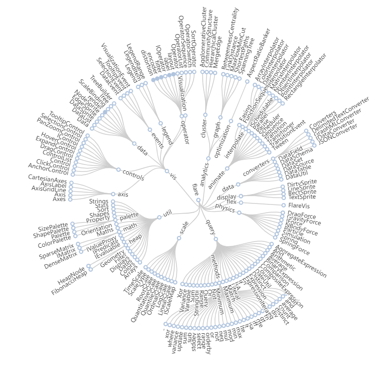

# ECharts Radial Tree Chart

Apache ECharts Radial Tree chart

[README](../../README.md)

## Table of Contents

* [Purpose](#purpose)
* [Data Summary](#data-summary)
* [Style](#style)
  * [Properties (JSON)](#properties-json)
* [Inputs](#inputs)
* [Outputs](#outputs)
* [Actions](#actions)
* [Data Details](#data-details)

## Purpose

The radial tree chart renders the data as a tree with each level drawn in a circle with lines drawn to parent at lower (inner) level.

The custom visualization is based on the ECharts Radial Tree example.

[Table of Contents](#table-of-contents)

## Data Summary

The radial tree visualization consumes multiple data sets: one for each level in the hierarchy. The details of the attributes of the data set is provided in the section Data Details section

1. __rootNode__
    * Details of the node at the root of the tree
1. __level1Relationship__
    * Details of nodes at level 1 of the hierarchy, i.e. nodes whose parent is the root node
1. __level2Relationship__
    * Details of nodes at level 2 of the hierarchy, i.e. nodes whose parent is at level 1
1. __level3Relationship__
    * Details of nodes at level 3 of the hierarchy, i.e. nodes whose parent is at level 2
1. __level4Relationship__
    * Details of nodes at level 4 of the hierarchy, i.e. nodes whose parent is at level 3

[Table of Contents](#table-of-contents)

## Style

The style of the visualization is controlled by a collection of properties.

__Note:__ Styling via CSS is not possible. ECharts charts are styled via options set in code. This is largely because the preferred implementation for rendering the chart, for browser performance reasons, is on a "canvas" which hides the components from the browser.

### Properties (JSON)

The properties mirror the properties in the __options__ object used to configure the ECharts chart. Further properties can be added be updating the code in this example. See [ECharts Chart Configuration](https://echarts.apache.org/en/option.html#title) for the complete list of available properties.

* __backgroundColor__: defines the background colour of the container for the chart. Supports setting as solid color using rgb(255,255,255), rgba(255,255,255,1), #fff. __Default rgba(255, 255, 255, 1)__
* __series__: styling properties for the chart elements
  * __top__: Distance between tree component and the top side of the container. __Default 18%__
  * __bottom__: Distance between tree component and the bottom side of the container. __Default 14%__
  * __symbol__: Type of symbol drawn at each node. __Default emptyCircle__
  * __symbolSize__: Symbol size. It can be set to single numbers like 10, or use an array to represent width and height. For example, [20, 10] means symbol width is 20, and height is 10. __Default 7__
  * __itemStyle__: Defines the style for the chart nodes.
    * __color__: the colour of the node symbol. Supports setting as solid color using rgb(255,255,255), rgba(255,255,255,1), #fff. __Default rgba(180, 180, 180, 0.2)__
  * __label__: Describes the style of the text corresponding to each node.
    * __show__: Defines if the labels are to be shown (true) or not (false). __Default true__
  * __emphasis__: Describes the style of emphasis when the mouse hovers over a node.
    * __focus__: Defines the nodes to highlight (not fade out). __Default descendant__. Can be one of
      * __none__ - Do not fade out other data
      * __self__ - Only focus (not fade out) the element of the currently highlighted node
      * __ancestor__ - Focus on all ancestor nodes
      * __descendant__ - Focus on all descendant nodes
      * __relative__ - Focus on all ancestor and descendant nodes

[Table of Contents](#table-of-contents)

## Inputs

The visualization has one input.

* __maxDepth__: a numeric value that defines Maximum Tree Depth. Changing the value collapses or expands the tree. __Default 2__

[Table of Contents](#table-of-contents)

## Outputs

The visualization has one output.

* __Node__: the identity of the node that the cursor is hovering over

[Table of Contents](#table-of-contents)

## Actions

The visualization has no actions.

[Table of Contents](#table-of-contents)

## Data Details

1. __rootNode__ – one element
    * __Name__: the name of the root element.
1. __level1Relationship__ – one or more relationships
    * __Source__: The source (parent) node
        * __Name__: the name of the parent element.
    * __Target__: The target (child) node
        * __Name__: the name of the child element.
        * __Value__: the value of the child element. This is optional and then only applicable to leaf nodes in the tree hierarchy
1. __level2Relationship__ – zero or more relationships. Same structure as __level1Relationship__
1. __level3Relationship__ – zero or more relationships. Same structure as __level1Relationship__
1. __level4Relationship__ – zero or more relationships. Same structure as __level1Relationship__

[Table of Contents](#table-of-contents)

[README](../../README.md)
