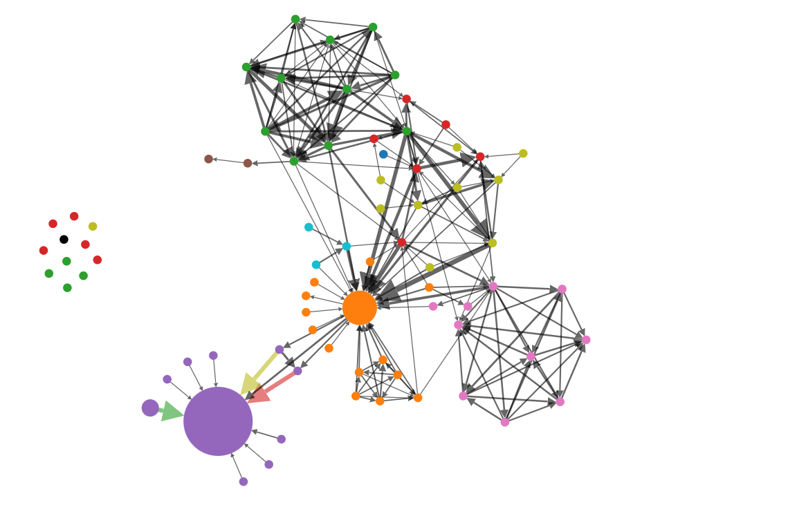

[README](../../README.md)

# Force Directed Layout

Force Direct Layout of nodes using D3 framework

# Table of Contents

*   [Purpose](#purpose)
*   [Data Summary](#data-summary)
*   [Style](#style)
    * [CSS](#css)
    * [Properties (JSON)](#properties-json)
*   [Inputs](#inputs)
*   [Outputs](#outputs)
*   [Actions](#actions)
*   [Data Details](#data-details)

# Purpose
The chart renders a set of linked nodes using D3's force-directed layout which uses a physics based simulator for positioning visual elements.

[Table of Contents](#table-of-contents)

# Data Summary

The Meta Model visualization consumes two data sets: nodes and links. The details of the attributes of the data set is provided in the section Data Details section
1.	__Nodes__
    * The list of nodes
1.  __Links__
    * List of links between the nodes

[Table of Contents](#table-of-contents)

# Style

The style of the visualization is controlled by CSS and a collection of properties.

## CSS

A Cascading Style Sheet (CSS) is defined containing selectors for the following HTML elements in the rendered diagram. The CSS is editable within MooD BA, allowing control of the visual styling of the diagram:

*	Text
*   Text Shadow
*   Node Labels (shown)
*   Node Labels (hidden)

[Table of Contents](#table-of-contents)

## Properties (JSON)

The properties are:

*   __Node Minimum Radius__: The minimum radius of circles drawn to represent nodes. __Default 5__
*   __Node Maximum Radius__: The minimum radius of circles drawn to represent nodes. __Default 100__
*   __Linked Node Force Strength__: The force exerted between linked nodes. Negative numbers specify repulsion, positive numbers specify attraction. __Default -40__
*   __Unlinked Node Force Strength__: The force exerted between unlinked nodes. Negative numbers specify repulsion, positive numbers specify attraction. __Default -10__
*   __Linked Node Cluster Repositioning Strength__: The strength of the force to move linked nodes to the to the centre of the graph where they will cluster. A value between 0 and 1. Higher values moves nodes more quickly to the target position. A value of zero will disable clustering of linked nodes. __Default 0.05__
*   __Unlinked Node Cluster Repositioning Strength__: The strength of the force to move unlinked nodes to the position where they will cluster. A value between 0 and 1. Higher values moves nodes more quickly to the target position. A value of zero will disable clustering of unlinked nodes. __Default 0.1__
*   __Unlinked Node Cluster x__: The x coordinate of the centre of the cluster zone for unlinked nodes. __Default 100__
*	__Link Colour__: The default colour of the line drawn between nodes representing links. __Default #000__
*   __Link Distance__: The minimum length of the link lines drawn between the edges of nodes. __Default 30__
*   __Link Arrow__: Indicates if an arrow marker should be drawn at the target end of the link (true) or not (false). __Default false__
*   __Ignore Unknown Nodes__: Indicates if links in the links dataset involving source ot target nodes not in the nodes dataset should be ignored (true) or reported as an error (false). __Default true__
*   __Show Label Node Separation__: Defines how close, in pixels, nodes need to be to the current (under cursor) node in order to display node labels when in __Show node labels__ mode 3 (Nearby). __Default 100__

[Table of Contents](#table-of-contents)

# Inputs

The visualization has one input.

* __Show node labels__: a numeric value that defines which node labels are displayed
   * 1 - None: do not display node labels, but a tooltip appears for the current (under cursor) node
   * 2 - All: display labels for all nodes
   * 3 - Nearby: display labels for nearby nodes (within __Show Label Node Separation__ pixels of the current node)

  __Note:__ when pinning this input, do not change the initial value / variable from 0 to 1, 2 or 3 as doing so will mean that this input cannot be changed back. __Default 1__

[Table of Contents](#table-of-contents)

# Outputs

The visualization has no outputs.

[Table of Contents](#table-of-contents)

# Actions

The visualization has no actions.

[Table of Contents](#table-of-contents)

# Data Details

1.	__Nodes__ – The list of nodes to visualise
    *	__Name__: Name of the node
    *   __Colour of node__: The colour to draw the circle representing the node
    *   __Size of Circle__: Radius of the circle
1.  __Links__ - the list of links between nodes
    *   __Source__: The source node of the link
        *    __Name__: The name of the source node
        *    __Colour of link__: The colour to draw the link line. If not defined, the __Colour of link__ defined for the target is used
    *   __Target__: The target node of the link
        *    __Name__: The name of the target node
        *    __Colour of link__: The colour to draw the link line. If not defined, the __Colour of link__ defined for the link is used
    *   __Weight of link__: Controls width of the line drawn between the nodes. The width is the square root of the weight. 
    *   __Colour of link__: The colour to draw the link line. If not defined, the __Link Colour__ defined in the stylep is used

[Table of Contents](#table-of-contents)

[README](../../README.md)
