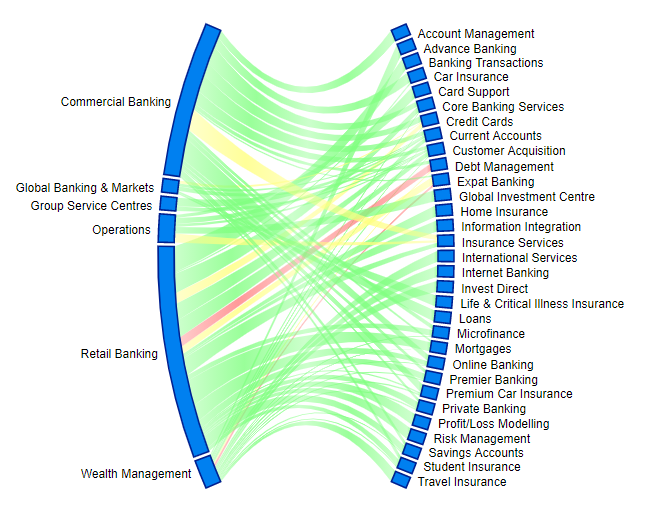

[README](../../README.md)

# Stretched Chord

Stretched Chord visualization

# Table of Contents

*   [Purpose](#purpose)
*   [Data Summary](#data-summary)
*   [Style](#style)
    * [CSS](#css)
    * [Properties (JSON)](#properties-json)
*   [Inputs](#inputs)
*   [Outputs](#outputs)
*   [Actions](#actions)
*   [Data Details](#data-details)

# Purpose
The Stretched Chord visualisation is a combination of a chord diagram and a Sankey diagram resulting in a more circular looking Sankey-like flow chart. Its primary purpose is to visualise the relationships between items in two distinct domains. For instance, showing how much your education defines where you end up working; visualising the number of people leaving education in various subjects entering careers in different areas of the economy. This implementation is based on work of [visualcinnamon.com](https://www.visualcinnamon.com/2015/08/stretched-chord) for Deloitte

[Table of Contents](#table-of-contents)

# Data Summary

The stretched chord consumes three data sets:
1.	__LHSnodes__: items on the left hand side of chart, e.g. education subjects
1.	__RHSnodes__: items on the right hand side of chart, e.g. careers
    * If the nodes on both sides are in the same domain, individual nodes can appear on both sides to show relationships to self
1.	__Links__: links between nodes, e.g. people entering a career with an education in a particular subject. The relationship can flow in either direction.

[Table of Contents](#table-of-contents)

# Style

The style of the visualization is controlled by CSS and a collection of properties.

## CSS

There is no Cascading Style Sheet (CSS) for the stretched chord custom visualiization.

[Table of Contents](#table-of-contents)

## Properties (JSON)

The style of the visualization is controlled by the following properties:
* __nodeColour__: colour to draw the nodes on the LHS and RHS arcs. __Default "#0080F0"__
* __nodeBorderColour__: colour to draw the 2 pixel border drawn around the nodes on the arcs. __Default "#002090"__
* __nodeSeparation__: the gap, in pixels, between nodes. __Default 5__
* __flowOpacity__: the opacity of the animated flow across the links. __Default 0.5__
* __minimumNodeSizePercentage__: the minimum size for a node as a percentage of overall length for nodes arcs. __Default 5__
* __flowPeriod__: the period of the flow animation across the links. __Default "5s"__
* __arcThickness__: the thickness, in pixels, of the node arcs. __Default 20__
* __arcCentreSeparation__: the horizontal separation, in pixels, between the centres of the arcs on the two sides. __Default 100__
* __labelMargin__: the width of the margin, in pixels, on the outer side of each arc reserved for drawing the node labels. __Default 220__
* __labelOffset__: the gap, in pixels, between the outer edge of the arc and the label text. __Default 10__
* __labelFontSize__: size, in pixels, of the font that the labels and link size pop-up are rendered in. __Default 15__
* __labelFontFamily__: the font family that the labels and link size pop-up are rendered in. __Default "sans-serif"__
* __headerHeight__: the size, in pixels, of a margin above the top of the arcs. __Default 10__
* __footerHeight__: the size, in pixels, of a margin above the top of the arcs. __Default 10__

[Table of Contents](#table-of-contents)

# Inputs

The visualization has no inputs.

[Table of Contents](#table-of-contents)

# Outputs

The visualization has the following outputs that MooD components can be pinned to
1.	__Node Hover__: the identity of the node on the arcs that the cursor is hovering over
2.	__Link Hover__: the identity of the link (relationship) that the cursor is hovering over

[Table of Contents](#table-of-contents)

# Actions

The visualization  the following events. These can be configured to trigger actions in MooD, e.g. navigation
1.	__Source Click__: a mouse click on a node on the LHS
    * Identifies the element
2.	__Target Click__: a mouse click on a node on the RHS
    * Identifies the element
3.	__Chord Click__: a mouse click on a chord
    * Identifies the relationship 

[Table of Contents](#table-of-contents)

# Data Details

1.	__LHSnodes__ one or more elements
    * __Name__: the name of the node
1.	__RHSnodes__ one or more elements
    * __Name__: the name of the node
1.	__Links__: links between nodes, e.g. people entering a career with an education in a particular subject. The relationship can flow in either direction.
    * __Source__: the identity of the source node of the link. Should be a node in either __LHSnodes__ or __RHSnodes__
    * __Target__: the identity of the target node of the link. Should be a node in either __LHSnodes__ or __RHSnodes__ and the opposite side to the __Source__
    * __Size__:	a numeric value on the relationship which is used to control the width of the chord displayed between the LHS and RHS
    * __Colour__:  a colour on the relationship which defines the colour of the chord displayed

[Table of Contents](#table-of-contents)

[README](../../README.md)
