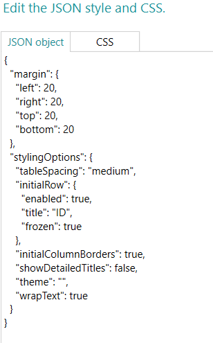
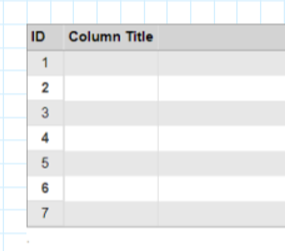

# Mood - Tabulator User Guide

## Table of Contents

1. [Description](#description)
2. [Getting Started](#getting-started)
    - [Installing Tabulator](#installing-tabulator)
    - [Using Tabulator](#using-tabulator)
3. [Column Configuration](#column-configuration)
    - [Defining Columns](#defining-columns)
    - [Column Groups](#column-groups)
    - [Column Formatting](#column-formatting)
      - [Date/Time Formatting](#datetime-formatting)
      - [Numeric Formatting](#numeric-formatting)
      - [Other Formatting](#other-formatting)
    - [Column Properties](#column-properties)
4. [Styling Options](#styling-options)
    - [Editing Styles](#editing-styles)
    - [Available Theme Options](#available-theme-options)
5. [Advanced Settings](#advanced-features)
    - [Row Grouping](#row-grouping)
    - [Navigation](#navigation)
    - [Global Settings](#global-settings)
      - [Editable](#editable)
      - [Resizable](#resizable)
      - [Column Sorting](#column-sorting)
      - [Header Filters](#header-filters)
      - [Column Calculations](#column-calculations)
6. [Current Limitations](#current-limitations)

## Description

Tabulator is a powerful, accessible component for creating interactive and customisable data tables. This guide provides a step-by-step approach to help you integrate and configure Tabulator effectively.

[Back to Table of Contents](#table-of-contents)

## Getting Started

### Installing Tabulator

1. Obtain the compiled Tabulator file, `Tabulator.zip`.
2. In Mood, navigate to the gallery in the explore tab.
3. Drag and drop the compiled file into the gallery.
4. Locate the Tabulator component.
5. Drag the component into your element.

---

### Using Tabulator

1. Select the Tabulator component in your element.
2. Access the settings panel.
3. Navigate to `Configure information shown`
4. Select your data query:
    - Click `row` to choose your desired query.
    - This will determine the dataset displayed in your grid.

[Back to Table of Contents](#table-of-contents)

---

## Column Configuration

### Defining Columns

Hovering over the `Columns` tab, click the `+` icon to add a column.

### Column Properties

#### General

- `Name` - This is the title that will be displayed in the header for this column. *Required*
- `Content` - This is the content that will be displayed in this column. Define the content source by selecting the value from the repository. *Required*

To define the content source, you will need to select a value from your repository by:

1. Clicking on the `Content` tab of this column.
2. Click `Select a value` on the right panel.
3. Locate and select the field from your data source.

#### Layout

- `Width` - Sets the width of this column, this can be set in pixels or as a percentage of total table width. Leave blank for auto-sizing.
- `Header Alignment` - Sets the horizontal text alignment for this columns header title (left|center|right)
- `Column Alignment` - Sets the horizontal text alignment for this column (left|center|right)
- `Formatting` - Set how you would like the data to be formatted. (see [Column Formatting](#column-formatting) for more details)
- `Frozen` - Freezes the column in place when scrolling.
- `Editable` - Allows cells to be editable.
  - Global setting `Editable` needs to be enabled (see [Global Settings](#global-settings) for more details)
- `Header Filter` - Show filters within the column header.
  - Global setting `Header Filtering` needs to be enabled (see [Global Settings](#global-settings) for more details)
- `Column Sorter` - Enable column sorting.
  - Global setting `Column Sorting` needs to be enabled (see [Global Settings](#global-settings) for more details)
- `Resizable` - Set whether this column can be resized by dragging its edges.
  - Global setting `Resizable` needs to be enabled (see [Global Settings](#global-settings) for more details)
- `Top Calculation` - Show column calculations at the top of the column.
  - Global setting `Top Column Calculations` needs to be enabled (see [Global Settings](#global-settings) for more details)

---

### Column Groups

To create column groups to organise related data:

1. Hovering over the `Groups` tab, click the `+` icon.
2. Give your group a name and add columns.
3. Add `SubGroups` for another level of nesting.
4. Click the collapse/expand arrows in the group's heading when previewing your web application to manage group visibility.

> Clickable group visibility arrows will only show up in the group's heading if the group holds multiple columns or sub groups.

[Back to Table of Contents](#table-of-contents)

---

## Column Formatting

### Date/Time Formatting

`timedata`: Displays both date and time.\
`date`: Shows date only.\
`time`: Shows time only.

Supports custom date formatting using patterns:

- `%ms`: Milliseconds
- `%ss`: Seconds
- `%mm`: Minutes
- `%HH`: Two-digit hour
- `%hh`: Two-digit hour
- `%H`: Single-digit hour
- `%h`: Single-digit hour
- `%dddd`: Full name of day (Monday)
- `%ddd`: Short name of day (Mon)
- `%dd`: Two-digit day
- `%MMMM`: Full name of month (August)
- `%MMM`: Short name of month (Aug)
- `%MM`: Two-digit month
- `%yyyy`: Four-digit year
- `%yy`: Two-digit year
- `%tt`: Terrestrial time
- Example: `%yyyy-%MM-%dd %HH %tt` for `2025-01-27 09 AM`

> These formatting options converts an ISO Date String to a desired format.

### Numeric Formatting

`star`: Converts numbers 0-5 to star ratings.

### Other Formatting

`tickCross`: Converts content to either a tick if the value is truthy or a cross if the value is falsy.

[Back to Table of Contents](#table-of-contents)

---

## Styling Options

### Editing Styles

Navigating to `Edit Style` in the settings panel opens a JSON configuration interface.

1. **Enable Initial Row ID Column**\
Set `enabled` to `true` inside the `initialRow` object to add an initial row ID column.
    - Default: `false` (the column is disabled)

2. **Change Table Theme**\
Set the `theme` property inside `stylingOptions` to one of the [available themes](#available-theme-options).

3. **Enable Text Wrapping**\
Set `wrapText` to `true` to automatically wrap all text instead of truncating it.

4. **Adjust Table Padding**\
Set `tableSpacing` to `"small"`, `"medium"` or `"large"` to adjust the table's padding size.

5. **Initial Column Borders**\
Set `initialColumnBorders` to `true` to add coloured borders at the start of each row.

6. **Show Detailed Titles**\
Set `showDetailedTitles` to `true` to display additional information in column group titles.

> **Note:** There is a **CSS** tab at the top of the **Edit Style** interface where you can manually customise CSS variables.
> Ensure the `theme` option is set to `""` (blank) to utilise custom CSS variables.

#### Initial Row ID Disabled

#### Initial Row ID Enabled

### Available Theme Options

`"Midnight"`: Dark mode interface.\
`"Basic"`: Minimalist appearance.\
Default: Default contemporary appearance.

> Default is applied when the theme is `""` (blank) or invalid.

[Back to Table of Contents](#table-of-contents)

---

## Advanced Features

### Row Grouping

You can group rows together that share a column value, this creates a visible header for each group and allows the user to collapse groups that they do not want to see.

1. For grouped rows, enable row grouping feature.
2. Specify grouping criteria by selecting a pick list.

---

### Navigation

For the option to navigate to a columns element when you right click on a cell, you will need to enable `navigable`.

1. To set up navigation, navigate to `Add Interactions` in the settings panel
2. Under `On User Interaction`, click `Cell Click`
3. Click `Add Action`
4. Add the `Navigate` action and provide a name.

---

### Global Settings

Global settings enable features that can be used throughout tabulator for each column. If a global setting is enabled, you can override this setting when configuring each column.

> Example: For header filtering, you will need to enable the global setting `Header Filters`. If you would like a specific column to have no header filter, you can disable `Header Filtering` when configuring the column. Check [Column Properties](#column-properties) for more details.

#### Editable

Enable in-line editing for each data cell.

> Override this feature for specific columns by changing the `Editable` field when configuring your columns.

#### Resizable

Enable columns to be resized by dragging the columns edges.

> Override this feature for specific columns by changing the `Resizable` field when configuring your columns.

#### Column Sorting

Enable column sorting for the ability to sort columns in ascending or descending order.

> Override this feature for specific columns by changing the `Column Sorter` field when configuring your columns.

#### Header Filters

Enable header filters for each column.

> Override this feature for specific columns by changing the `Header Filter` field when configuring your columns.

#### Column Calculations

Column calculations can be used to add a row of calculated values to the top of your table to display information such as the sum of a columns data.

To enable Column Calculations, you will need to enable the global setting `Top Column Calculations`

To define a calculation, the `Top Calculation` option when configuring a column defines a calculation for the top of the column.

Tabulator comes with a number of preconfigured calculations:

- `avg`: Calculates the average value of all numerical cells in a column.
- `max`: Displays the maximum value from all numerical cells in a column.
- `min`: Displays the minimum value from all numerical cells in a column.
- `sum`: Displays the sum of all numerical cells in a column.
- `concat`: Joins the values of all cells in a column together as a string.
- `count`: Counts the number of non-empty cells in a column (cells that do not have a value of null, undefined or "").
- `unique`: Counts the number of unique non-empty values in a column (cells that do not have a value of null, undefined or "").
- Default: Leave blank for no calculation to be displayed for a specific column.

> Default is applied when the calculation field is blank or invalid.

[Back to Table of Contents](#table-of-contents)

---

## Current Limitations

1. Drop-down menus are currently not available for selecting column formatting options for example. You will have to manually type these options into a text input field.

[Back to Table of Contents](#table-of-contents)
