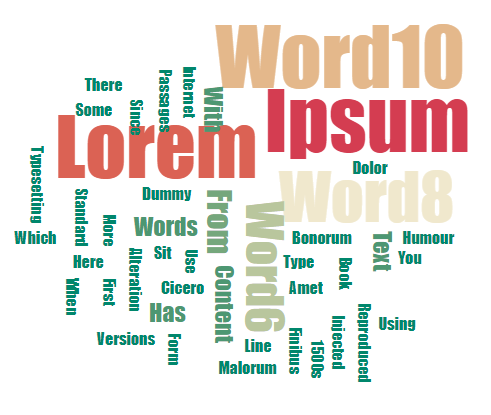

[README](../../README.md)

# Word Cloud

Word Cloud visualization

# Table of Contents

*   [Purpose](#purpose)
*   [Data Summary](#data-summary)
*   [Style](#style)
    * [CSS](#css)
    * [Properties (JSON)](#properties-json)
*   [Inputs](#inputs)
*   [Outputs](#outputs)
*   [Actions](#actions)
*   [Data Details](#data-details)

# Purpose
Word clouds are useful for quickly perceiving the most prominent terms in a body of text. The MooD Word Cloud visualisation uses colour and text size to differentiate between the more and the less used terms. The word cloud custom visualization is based on D3 word cloud:

The colour palette, font size range and words to ignore can be configured to tailor the Word Cloud.

Note: Words that are too large to fit into the Word Cloud rectangle are omitted. The font size configuration can be altered to ensure that long prominent words appear in the Word Cloud.

[Table of Contents](#table-of-contents)

# Data Summary

The Word Cloud visualisation consumes a single data set. The details of the attributes of the data set is provided in the section Data Details section
1.	__Rows__
    * A list of text to visualise

[Table of Contents](#table-of-contents)

# Style

The style of the visualization is controlled by CSS and a collection of properties.

## CSS

A Cascading Style Sheet (CSS) is defined containing selectors for the following HTML elements in the rendered diagram. The CSS is editable within MooD BA, allowing control of the visual styling of the diagram:

*	Background colour

[Table of Contents](#table-of-contents)

## Properties (JSON)

The properties are:

*	__margin__: defines the size of a margin around the edge of the chart
    *	__top__: size of margin across the top in pixels. __Default 5__
    *	__bottom__: size of margin across the bottom in pixels. __Default 5__
    *	__left__: size of margin across the left-hand side in pixels. __Default 5__
    *	__right__: size of margin across the right-hand side in pixels. __Default 5__
*	__minWordLength__: The minimum number of characters a word must be in order to be included in the Word Cloud. __Default: 3__
*	__minInstanceCount__: The minimum number of times a word must appear in the entire body of text in order to be included in the Word Cloud. __Default: 2__
*	__baseFontSize__: The smallest font size in pixels to use for the least common words in the Word Cloud. __Default: 20__
*	__maxFontSize__: The largest font size in pixels to use for the most common words in the Word Cloud. __Default: 100__
*	__instanceMultiplier__: The amount, in pixels, to increase font size of words per increase in occurrence. The font size is calculated as __baseFontSize__ + (word occurrence count - __minInstanceCount__) * __instanceMultiplier__. The font size is bounded to be no larger than __maxFontSize__. __Default: 10__
*	__ignoreWords__: An array of words to ignore, i.e. exclude from the Word Cloud. __Default: the, and, this, are, but, its, for, that, also__
*	__colourPalette__: An array of RGB colours used to distinguish more common from less common words. The least common words are rendered in the first colour, the most common words are rendered in the last colour in the array, and others using intermediate colours. The length of the array can be altered to suit. __The default array ranges from Green to Red__

[Table of Contents](#table-of-contents)

# Inputs

The visualization has no inputs.

[Table of Contents](#table-of-contents)

# Outputs

The visualization has no outputs.

[Table of Contents](#table-of-contents)

# Actions

The visualization has no actions.

[Table of Contents](#table-of-contents)

# Data Details

1.	__Rows__ – zero or more elements
    * __Text__: : text to be included in the Word Cloud

[Table of Contents](#table-of-contents)

[README](../../README.md)
